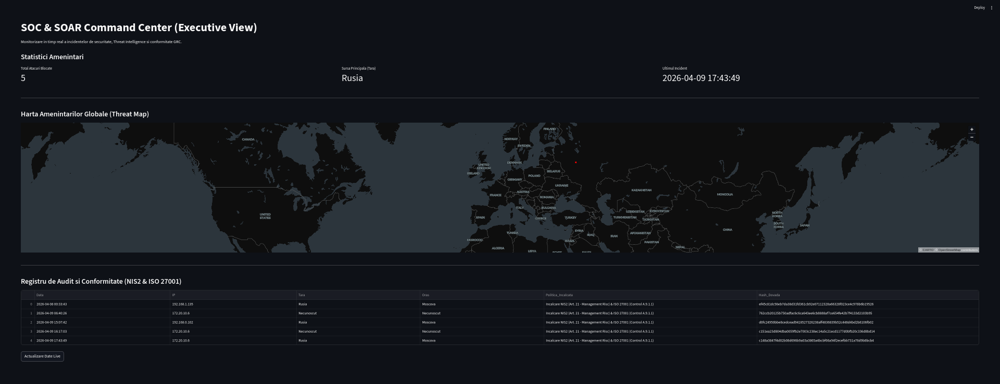
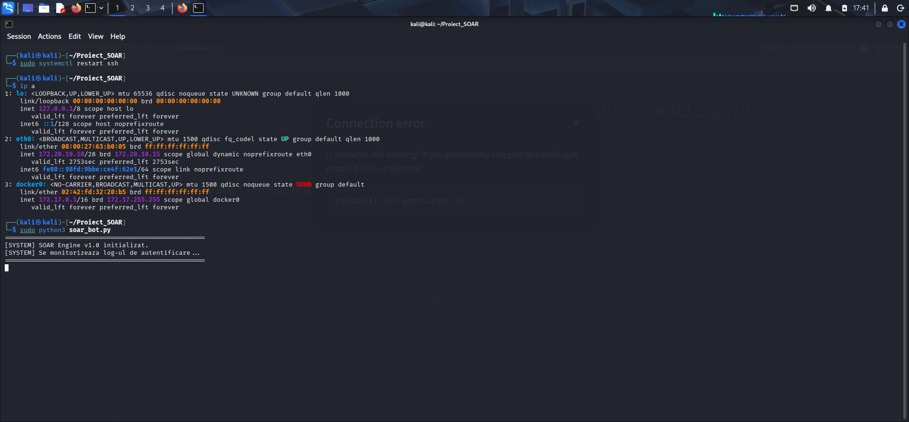

# SOAR & GRC Automation Tool

Acest proiect este un sistem de tip SOAR (Security Orchestration, Automation, and Response) dezvoltat în Python. Rolul principal al aplicației este de a monitoriza jurnalele de sistem Linux în timp real, de a bloca automat atacurile de tip Brute Force și de a genera rapoarte de incident care respectă cerințele de audit GRC.

## Arhitectura Sistemului (Cei 4 Piloni)

Sistemul este construit pe o arhitectură modulară, acoperind întregul ciclu de viață al unui incident de securitate:

1. **SOC (Monitorizare și Detecție):**
   * Parsează fluxul de date din `/var/log/auth.log` în timp real.
   * Utilizează expresii regulate (Regex) pentru a extrage automat adresele IP ale atacatorilor în cadrul tentativelor de tip SSH Brute Force.
2. **SOAR (Orchestrare și Remediere Automată):**
   * Implementează o logică de tip "Threshold" (prag setat la 5 încercări eșuate).
   * La atingerea pragului, engine-ul interacționează direct cu nivelul OS pentru a injecta o regulă `DROP` în IPTables, izolând sursa la nivel de rețea.
3. **Threat Intelligence (Îmbogățirea Datelor):**
   * Interoghează API-uri externe pentru a realiza geolocalizarea IP-ului blocat (GeoIP).
   * Include un mecanism de tip fallback pentru identificarea și etichetarea corectă a claselor de IP-uri private (non-rutabile conform RFC 1918).
4. **GRC & Forensics (Audit Legal):**
   * Asigură trasabilitatea și integritatea dovezilor ("Chain of Custody") prin generarea unui hash criptografic SHA-256 pe datele brute ale atacului.
   * Transformă datele tehnice într-un Raport Executiv (PDF) utilizabil în procesele de audit.

## Conformitate și Standarde (Mapping)
Sistemul aplică măsuri tehnice care ajută la alinierea cu cerințele legislative și standardele internaționale:
* **Directiva NIS2 (Art. 21):** Demonstrează aplicarea de politici active pentru managementul riscului și răspunsul la incidente.
* **ISO/IEC 27001 (Controlul A.9.1.1):** Asigură controlul strict al accesului și restricționarea automată a rețelelor în caz de anomalii.

---

## Componente și Flux de Lucru (Vizualizare Sistem)

### Vedere de Ansamblu: Dashboard Executiv

*Interfața principală centralizată, oferind vizibilitate completă asupra statisticilor, distribuției globale a amenințărilor și registrului de conformitate.*

### 1. Engine-ul de Detecție și Remediere (Backend)

*Inițializarea daemon-ului de securitate în terminalul serverului. Sistemul monitorizează stream-ul de loguri pentru anomalii de autentificare.*

### 2. Raportare Executivă și Forensics
📄 **[Vezi Exemplul de Raport PDF Generat Automat Aici](Raport_Incident_192_168_1_135.pdf)**
*Raportul oficial de incident (PDF) generat imediat după blocarea IP-ului. Conține detaliile tehnice ale atacului și lanțul de custodie (semnătura digitală).*

---

## Stack Tehnologic
* **Limbaj:** Python 3
* **OS:** Linux (testat pe medii Debian/Kali)
* **Librării:** `pandas`, `streamlit` (UI), `requests` (API Call), `fpdf` (Generare Rapoarte), `hashlib` (Criptografie).

## Instrucțiuni de Utilizare

* 1.Clonarea repository-ului și instalarea cerințelor:
```bash
git clone [https://github.com/DanAndGvr/SOAR-GRC-Automator.git](https://github.com/DanAndGvr/SOAR-GRC-Automator.git)
cd SOAR-GRC-Automator
pip3 install pandas streamlit requests fpdf

```
* 2.Rularea engine-ului principal (necesită privilegii root):
  sudo python3 soar_bot.py
* 3.Pornirea interfeței web (într-un terminal separat):
  streamlit run dashboard.py
